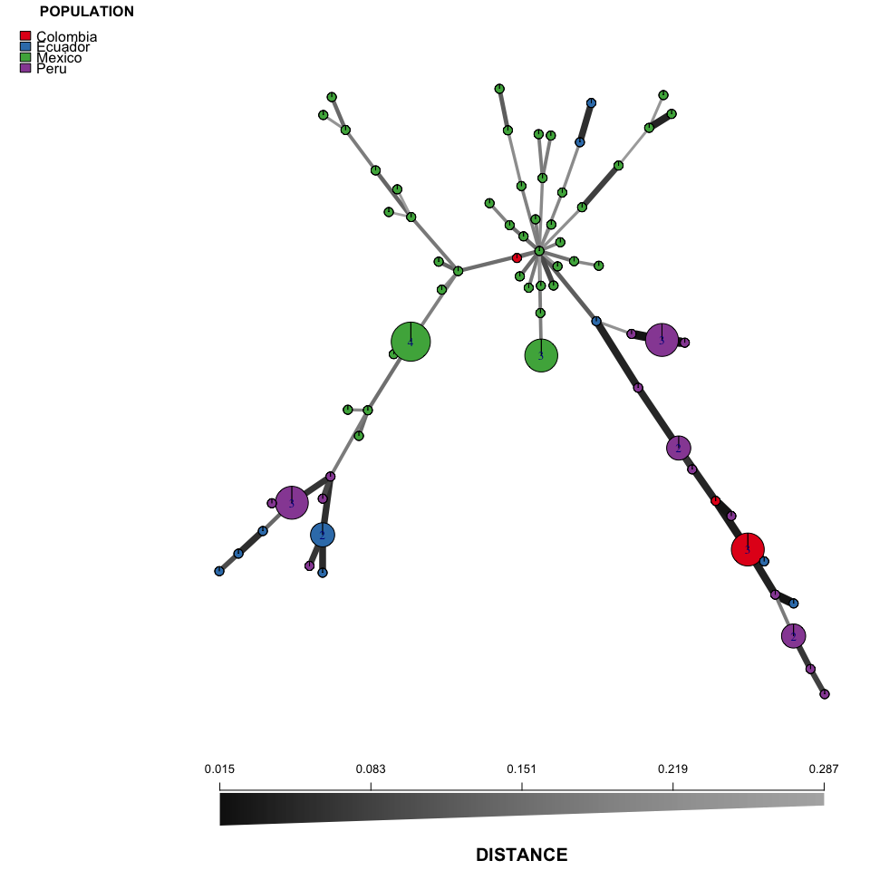

# *P. infestans* Index of Assocation and Minimum Spanning Network Analysis
Zhian N. Kamvar  
July 10, 2016  


# Introduction

In this analysis, I am analyzing 86 samples of *Phytophthora infestans* from 
North America and South America genotyped at 11 microsattelite loci. Note, that 
some of these samples appear to be triploid. I will be asessing clonality by 
calculating the standardized index of association ($\bar{r}_d$) 
[@agapow2001indices] and showing population structure by creating a minimum 
spanning network from Bruvo's genetic distance [@bruvo2004simple].

I used the R package *poppr* version 2.2.0 to perform the analysis, The minimum
spanning network was constructed with *igraph* version 1.0.1, The figures were
constructed with *ggplot2* version 2.1.0.


```r
library('poppr')
library('ggplot2')
library('RColorBrewer')
```

To read in the data, I used `read.genalex()` function from *poppr*, specifying a
ploidy of "3". Because Bruvo's distance requires knowledge of repeat lengths, I
supplied them for each locus and then ensured that they were consistent with the
*poppr* function `fix_replen()`.


```r
pinf <- read.genalex("pinfestans_mx_sa.csv", ploidy = 3)
splitStrata(pinf) <- ~Continent/Country
setPop(pinf) <- ~Continent
pinfreps <- c(Pi02 = 2, D13 = 2, Pi33 = 6, Pi04 = 2, Pi4B = 2, Pi16 = 2,
              G11 = 2, Pi56 = 2, Pi63 = 3, Pi70 = 3, Pi89 = 2)
pinfreps <- fix_replen(pinf, pinfreps)
```

# Index of Assocation

I used the function `poppr()` to calculate the index of assocation for both
North American and South American populations, this was done for total
populations and clone-corrected at the country level. To assess significance,
alleles were shuffled at each locus independently 999 times.


```r
set.seed(20160730)
res <- poppr(pinf, sample = 999, quiet = TRUE,
             H = FALSE, G = FALSE, lambda = FALSE, E5 = FALSE,
             total = FALSE)
```

```r
set.seed(20160730)
res_cc <- poppr(pinf, sample = 999, clonecorrect = TRUE, quiet = TRUE,
             H = FALSE, G = FALSE, lambda = FALSE, E5 = FALSE,
             strata = ~Continent/Country, keep = 1, total = FALSE)
```

```r
knitr::kable(res, digits = 2, caption = "Total Data Set")
```


Table: Total Data Set

Pop               N   MLG    eMLG     SE   Hexp     Ia   p.Ia   rbarD   p.rD  File 
--------------  ---  ----  ------  -----  -----  -----  -----  ------  -----  -----
South America    38    29   29.00   0.00   0.51   2.87   0.00    0.34   0.00  pinf 
North America    48    43   34.45   0.99   0.50   0.22   0.01    0.02   0.01  pinf 

```r
knitr::kable(res_cc, digits = 2, caption = "Clone Corrected Data")
```


Table: Clone Corrected Data

Pop               N   MLG   eMLG    SE   Hexp     Ia   p.Ia   rbarD   p.rD  File 
--------------  ---  ----  -----  ----  -----  -----  -----  ------  -----  -----
South America    29    29     29     0   0.52   2.63    0.0    0.31   0.00  pinf 
North America    43    43     29   NaN   0.51   0.08    0.2    0.01   0.19  pinf 

```r
p <- last_plot()
op <- p # save the original plot
```

The results show that there is no evidence for linkage in the North American
population while there is significant linkage in the South American population
for the clone-corrected data set, suggesting a mainly sexual mode of
reproduction for the North American population. I then used the *ggplot2*
package to plot the results of the randomization procedure on the
clone-corrected data as a histogram.


```r
p <- p + facet_wrap(~population, ncol = 1, scales = "free")
p <- p + theme_bw() # initial theme
p <- p + theme(text = element_text(size = rel(5))) # make everything bigger
p <- p + theme(plot.title = element_text(size = rel(4))) # make the title bigger
p <- p + theme(axis.ticks.y = element_blank()) # remove y axis
p <- p + theme(axis.text.y = element_blank())  # remove y axis
p <- p + theme(strip.background = element_blank()) # remove facet label backgrounds
p <- p + theme(strip.text = element_text(face = "bold")) # make facet labels bold
p <- p + theme(panel.grid = element_blank()) # remove gridlines
p <- p + labs(title = "Index of Assocation for clone-corrected data")
p <- p + labs(y = NULL)
p
```

<!-- -->

# Minimum Spanning Network

To display the diversity of the population, I used the packages *poppr* and
*igraph* to construct a minimum spanning network from Bruvo's distance using a
genome addition model [@bruvo2004simple]. This was initially constructed
visually using the function `imsn()` and then the code from the "Command" tab
was copied and pasted to reproduce the plot. Before plotting, population was set
to Country.

In the plot, nodes represent multilocus genotypes, whose sizes are scaled
relative to the number of samples in each. Node colors represent population
membership and thicker, darker-shaded lines represent closer genetic connections
between nodes.


```r
setPop(pinf) <- ~Country
min_span_net <- bruvo.msn(pinf, replen = pinfreps, add = TRUE, loss = FALSE,
                          showplot = FALSE, include.ties = TRUE)
set.seed(70)
plot_poppr_msn(pinf,
               min_span_net,
               inds = "none",
               mlg = FALSE,
               gadj = 6,
               nodebase = 1.15,
               palette = RColorBrewer::brewer.pal(4, "Set1"),
               cutoff = NULL,
               quantiles = FALSE,
               beforecut = TRUE)
```

<!-- -->

# R environment

The following packages were used in this analysis.


```r
devtools::session_info()
```

```
## Session info ---------------------------------------------------------------------------------------
```

```
##  setting  value                       
##  version  R version 3.3.1 (2016-06-21)
##  system   x86_64, darwin13.4.0        
##  ui       X11                         
##  language (EN)                        
##  collate  en_US.UTF-8                 
##  tz       America/Los_Angeles         
##  date     2016-07-11
```

```
## Packages -------------------------------------------------------------------------------------------
```

```
##  package      * version     date       source                            
##  ade4         * 1.7-4       2016-03-01 CRAN (R 3.2.3)                    
##  adegenet     * 2.0.1       2016-02-15 CRAN (R 3.3.0)                    
##  ape            3.5         2016-05-24 CRAN (R 3.3.0)                    
##  assertthat     0.1         2013-12-06 CRAN (R 3.2.0)                    
##  boot           1.3-18      2016-02-23 CRAN (R 3.2.3)                    
##  cluster        2.0.4       2016-04-18 CRAN (R 3.3.0)                    
##  coda           0.18-1      2015-10-16 CRAN (R 3.2.0)                    
##  colorspace     1.2-6       2015-03-11 CRAN (R 3.2.0)                    
##  DBI            0.4-1       2016-05-08 CRAN (R 3.3.0)                    
##  deldir         0.1-12      2016-03-06 CRAN (R 3.2.4)                    
##  devtools       1.12.0      2016-06-24 CRAN (R 3.3.0)                    
##  digest         0.6.9       2016-01-08 CRAN (R 3.2.3)                    
##  dplyr          0.5.0       2016-06-24 CRAN (R 3.3.0)                    
##  evaluate       0.9         2016-04-29 CRAN (R 3.2.5)                    
##  fastmatch      1.0-4       2012-01-21 CRAN (R 3.2.0)                    
##  formatR        1.4         2016-05-09 CRAN (R 3.3.0)                    
##  gdata          2.17.0      2015-07-04 CRAN (R 3.2.0)                    
##  ggplot2      * 2.1.0       2016-03-01 CRAN (R 3.3.0)                    
##  gmodels        2.16.2      2015-07-22 CRAN (R 3.2.0)                    
##  gtable         0.2.0       2016-02-26 CRAN (R 3.2.3)                    
##  gtools         3.5.0       2015-05-29 CRAN (R 3.2.0)                    
##  highr          0.6         2016-05-09 CRAN (R 3.3.0)                    
##  htmltools      0.3.5       2016-03-21 CRAN (R 3.2.4)                    
##  httpuv         1.3.3       2015-08-04 CRAN (R 3.2.0)                    
##  igraph         1.0.1       2015-06-26 CRAN (R 3.2.0)                    
##  knitr          1.13        2016-05-09 CRAN (R 3.3.0)                    
##  labeling       0.3         2014-08-23 CRAN (R 3.2.0)                    
##  lattice        0.20-33     2015-07-14 CRAN (R 3.2.0)                    
##  LearnBayes     2.15        2014-05-29 CRAN (R 3.2.0)                    
##  magrittr       1.5         2014-11-22 CRAN (R 3.2.0)                    
##  MASS           7.3-45      2015-11-10 CRAN (R 3.2.2)                    
##  Matrix         1.2-6       2016-05-02 CRAN (R 3.3.0)                    
##  memoise        1.0.0       2016-01-29 CRAN (R 3.2.3)                    
##  mgcv           1.8-12      2016-03-03 CRAN (R 3.2.4)                    
##  mime           0.4         2015-09-03 CRAN (R 3.2.0)                    
##  munsell        0.4.3       2016-02-13 CRAN (R 3.2.3)                    
##  nlme           3.1-128     2016-05-10 CRAN (R 3.3.0)                    
##  nnls           1.4         2012-03-19 CRAN (R 3.2.0)                    
##  pegas          0.9         2016-04-16 CRAN (R 3.2.5)                    
##  permute        0.9-0       2016-01-24 CRAN (R 3.2.3)                    
##  phangorn       2.0.3       2016-05-01 CRAN (R 3.2.5)                    
##  plyr           1.8.4       2016-06-08 CRAN (R 3.3.0)                    
##  poppr        * 2.2.0       2016-06-13 CRAN (R 3.3.0)                    
##  quadprog       1.5-5       2013-04-17 CRAN (R 3.2.0)                    
##  R6             2.1.2       2016-01-26 CRAN (R 3.2.3)                    
##  RColorBrewer * 1.1-2       2014-12-07 CRAN (R 3.2.0)                    
##  Rcpp           0.12.5      2016-05-14 CRAN (R 3.3.0)                    
##  reshape2       1.4.1       2014-12-06 CRAN (R 3.2.0)                    
##  rmarkdown      0.9.6.14    2016-07-12 Github (rstudio/rmarkdown@bc331f2)
##  scales         0.4.0       2016-02-26 CRAN (R 3.2.3)                    
##  seqinr         3.1-5       2016-06-08 CRAN (R 3.3.0)                    
##  shiny          0.13.2.9004 2016-06-23 Github (rstudio/shiny@bf52075)    
##  sp             1.2-3       2016-04-14 CRAN (R 3.3.0)                    
##  spdep          0.6-5       2016-06-02 CRAN (R 3.3.0)                    
##  stringi        1.1.1       2016-05-27 CRAN (R 3.3.0)                    
##  stringr        1.0.0       2015-04-30 CRAN (R 3.2.0)                    
##  tibble         1.1         2016-07-04 CRAN (R 3.3.0)                    
##  vegan          2.3-5       2016-04-09 CRAN (R 3.2.4)                    
##  withr          1.0.2       2016-06-20 cran (@1.0.2)                     
##  xtable         1.8-2       2016-02-05 CRAN (R 3.2.3)                    
##  yaml           2.1.13      2014-06-12 CRAN (R 3.2.0)
```

# References
